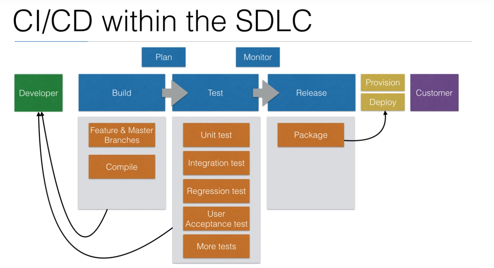

# Udemy Jenkins #

### Documento Inicial

```
Learn DevOps: Jenkins - Procedure document

Github repository: https://github.com/wardviaene/jenkins-course
Facebook group: https://www.facebook.com/groups/840062592768074/
DigitalOcean free $10 coupon: https://m.do.co/c/007f99ffb902

Full list of installation parameters: see https://hub.docker.com/_/jenkins/

Install Docker
$ sudo apt-get update
$ sudo apt-key adv --keyserver hkp://p80.pool.sks-keyservers.net:80 --recv-keys 58118E89F3A912897C070ADBF76221572C52609D
$ sudo apt-add-repository 'deb https://apt.dockerproject.org/repo ubuntu-xenial main'
$ sudo apt-get update
$ sudo apt-get install -y docker-engine
$ sudo systemctl enable docker

Install Jenkins
$ sudo mkdir -p /var/jenkins_home
$ sudo chown -R 1000:1000 /var/jenkins_home/
$ docker run -p 8080:8080 -p 50000:50000 -v /var/jenkins_home:/var/jenkins_home --name jenkins -d jenkins/jenkins:lts


Open browser and go to: http://IP:8080/ (change IP to your droplet IP)

You will be asked for initial password for the Jenkins, you can get this password by entering following command on your server.

$ cat /var/jenkins_home/secrets/initialAdminPassword

A screen with “Create First admin User prompt” will appear. You will need to enter a username, password, full name and email address.

```
## Introducción y características

* Jenkins es una herramienta open source para CI/CD
* Es un servidor de automatización usado para construir y desplegar proyectos de software.
* El mayor beneficio de jenkins es la gran cantidad de plugins que posee.


### Flujo ideal y general de Jenkins en SDLC ( Software Development Life Cycle/ Ciclo de vida de desarrollo de software )




## Referencias recomendadas ##
1. http://codehero.co/author/jonathan.html
1. http://charlascylon.com/tutorialmongo
