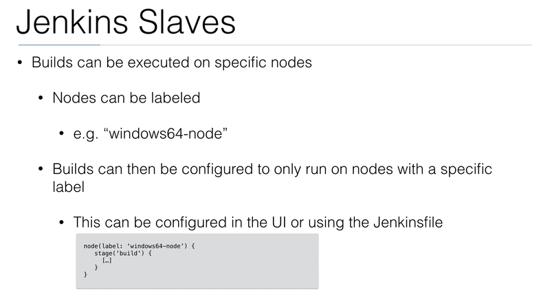
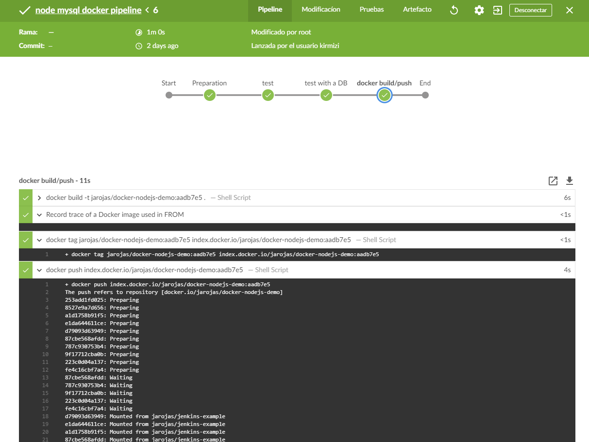

# Udemy Jenkins #

### Documento Inicial

```
Learn DevOps: Jenkins - Procedure document

Github repository: https://github.com/wardviaene/jenkins-course
Facebook group: https://www.facebook.com/groups/840062592768074/
DigitalOcean free $10 coupon: https://m.do.co/c/007f99ffb902

Full list of installation parameters: see https://hub.docker.com/_/jenkins/

Install Docker
$ sudo apt-get update
$ sudo apt-key adv --keyserver hkp://p80.pool.sks-keyservers.net:80 --recv-keys 58118E89F3A912897C070ADBF76221572C52609D
$ sudo apt-add-repository 'deb https://apt.dockerproject.org/repo ubuntu-xenial main'
$ sudo apt-get update
$ sudo apt-get install -y docker-engine
$ sudo systemctl enable docker

Install Jenkins
$ sudo mkdir -p /var/jenkins_home
$ sudo chown -R 1000:1000 /var/jenkins_home/
$ docker run -p 8080:8080 -p 50000:50000 -v /var/jenkins_home:/var/jenkins_home --name jenkins -d jenkins/jenkins:lts


Open browser and go to: http://IP:8080/ (change IP to your droplet IP)

You will be asked for initial password for the Jenkins, you can get this password by entering following command on your server.

$ cat /var/jenkins_home/secrets/initialAdminPassword

A screen with “Create First admin User prompt” will appear. You will need to enter a username, password, full name and email address.

```
## Introducción y características

* Jenkins es una herramienta open source para CI/CD
* Es un servidor de automatización usado para construir y desplegar proyectos de software.
* El mayor beneficio de jenkins es la gran cantidad de plugins que posee.


### Flujo ideal y general de Jenkins en SDLC ( Software Development Life Cycle/ Ciclo de vida de desarrollo de software )


## Alternativas a Jenkins

* Self Hosted
  * Drone CI
  * TeamCity
* Hosted (As a service)|
  * Amazon AWS CI/CD Tools
  * Circle CI
  * Gitlab CI/CD
  * Travis
  * CodeShip
  * Wercker
  * SemaphoreCI
  
## Imagen de Jenkins con docker ###
```yml
FROM jenkins/jenkins
USER root

RUN mkdir -p /tmp/download && \
 curl -L https://download.docker.com/linux/static/stable/x86_64/docker-18.03.1-ce.tgz | tar -xz -C /tmp/download && \
 rm -rf /tmp/download/docker/dockerd && \
 mv /tmp/download/docker/docker* /usr/local/bin/ && \
 rm -rf /tmp/download && \
 groupadd -g 999 docker && \
 usermod -aG staff,docker jenkins

user jenkins
```

# Jenkins as code ##

## Jenkins Job DSL
  
* Para escribir código que permita crear y modificar jenkins jobs automáticamente.
* DSL / Domain Specific Language
* Se pueden describir los jobs usando el lenguaje Groovy.
* Instalar Jobs DSL Plugin

Ejemplo Script en Groovy:
    
    https://jenkinsci.github.io/job-dsl-plugin/#method/javaposse.jobdsl.dsl.helpers.step.StepContext.dockerBuildAndPublish

### Groovy - node

```groovy
job('NodeJS example') {
    scm {
        git('git://github.com/wardviaene/docker-demo.git') {  node -> // is hudson.plugins.git.GitSCM
            node / gitConfigName('DSL User')
            node / gitConfigEmail('jenkins-dsl@newtech.academy')
        }
    }
    triggers {
        scm('H/5 * * * *')
    }
    wrappers {
        nodejs('nodejs') // this is the name of the NodeJS installation in 
                         // Manage Jenkins -> Configure Tools -> NodeJS Installations -> Name
    }
    steps {
        shell("npm install")
    }
}
```

### Groovy - node - docker

```groovy
job('NodeJS Docker example') {
    scm {
        git('git://github.com/wardviaene/docker-demo.git') {  node -> // is hudson.plugins.git.GitSCM
            node / gitConfigName('DSL User')
            node / gitConfigEmail('jenkins-dsl@newtech.academy')
        }
    }
    triggers {
        scm('H/5 * * * *')
    }
    wrappers {
        nodejs('nodejs') // this is the name of the NodeJS installation in 
                         // Manage Jenkins -> Configure Tools -> NodeJS Installations -> Name
    }
    steps {
        dockerBuildAndPublish {
            repositoryName('wardviaene/docker-nodejs-demo')
            tag('${GIT_REVISION,length=9}')
            registryCredentials('dockerhub')
            forcePull(false)
            forceTag(false)
            createFingerprints(false)
            skipDecorate()
        }
    }
}
```


## Jenkins Pipeline (Jenkinsfile)

* Diferencia entre Declarative Pipeline(pipeline) y Scripted Pipeline(node)
    https://jenkins.io/doc/book/pipeline/#tuber%C3%ADa-pipeline


    Nota Importante: Jenkins permite que en sus jobs y pipelines se haga uso de sus múltiples plugins, sin embargo, es mucho mejor correr las etapas de los pipeline en contenedores. De esta forma en vez de plugins de jenkins es posible usar la infinidad de imágenes de docker para construir, testear, desplegar, etc.

```groovy
node {
   def commit_id
   stage('Preparation') {
     checkout scm
     sh "git rev-parse --short HEAD > .git/commit-id"
     commit_id = readFile('.git/commit-id').trim()
   }
   stage('test') {
     def myTestContainer = docker.image('node:4.6')
     myTestContainer.pull()
     myTestContainer.inside {
       sh 'npm install --only=dev'
       sh 'npm test'
     }
   }
   stage('test with a DB') {
     def mysql = docker.image('mysql').run("-e MYSQL_ALLOW_EMPTY_PASSWORD=yes") 
     def myTestContainer = docker.image('node:4.6')
     myTestContainer.pull()
     myTestContainer.inside("--link ${mysql.id}:mysql") { // using linking, mysql will be available at host: mysql, port: 3306
          sh 'npm install --only=dev' 
          sh 'npm test'                     
     }                                   
     mysql.stop()
   }                                     
   stage('docker build/push') {            
     docker.withRegistry('https://index.docker.io/v1/', 'dockerhub') {
       def app = docker.build("wardviaene/docker-nodejs-demo:${commit_id}", '.').push()
     }                                     
   }                                       
}
```

## Integraciones con Jenkins / Plugins

Identifico 3 formas de disparar un job en jenkins:

* Acción manual simplemente disparando el job mediante consola web
* Ejecución periodica por consola web similar a un crontab.
* Verificación de jenkins cada N minutos al repo para identificar si hubo algún cambio.
* LA MEJOR ES asincrónicamente mediante plugins del CVS que se este usando, esto por ejemplo si es github, hará que cada vez que se haga push al repo github envíe al jenkins una peticion http para que inicie el job.

### Notificaciones Slack

    Ejemplo envió de notificaciones por slack

```groovy
node {

  // job
  try {
    stage('build') {
      println('so far so good...')
    }
    stage('test') {
      println('A test has failed!')
      sh 'exit 1'
    }
  } catch(e) {
    // mark build as failed
    currentBuild.result = "FAILURE";

    // send slack notification
    slackSend (color: '#00FFFF', message: "FAILED: Job '${env.JOB_NAME} [${env.BUILD_NUMBER}]' (${env.BUILD_URL})")

    // throw the error
    throw e;
  }
}

```

## Escanear repositorios automáticamente ##

    Mediante el plugin de CVS indicado, es posible que jenkins escanee los repos de una organización o un usuario, con esto no es necesario agregar reposiotrio por reposiotrio a jenkins sino que automáticamente va a escanear todos los reposiotrios de una organización y va a ejecutar los Jenkinsfile que detecte.


## Custom API Integration ##


En ocaciones puede que los plugins de jenkins que hacen llamados a APIs no tengan las suficientes funcionalidades o ni siquiera exista un plugin. Al momento de crear un pipeline, jenkins brinda la sintaxis de los plugins instalados para usarlos con groovy en el jenkinsfile:


Además, usando groovy, los Jenkinsfile y el plugin llamado `http request plugin` se puede realizar peticiones a un API como a continuación se usa el api de bitbucket para realizar un pull request sobre determinado repo:

```groovy
// example of custom API
import groovy.json.JsonSlurperClassic 

@NonCPS
def jsonParse(def json) {
    new groovy.json.JsonSlurperClassic().parseText(json)
}

def repo = "edwardviaene/jenkins-course"

def token = httpRequest authentication: 'bitbucket-oauth', contentType: 'APPLICATION_FORM', httpMode: 'POST', requestBody: 'grant_type=client_credentials', url: 'https://bitbucket.org/site/oauth2/access_token'
def accessToken = jsonParse(token.content).access_token
def pr = httpRequest customHeaders: [[maskValue: true, name: 'Authorization', value: 'Bearer ' + accessToken]], url: "https://api.bitbucket.org/2.0/repositories/${repo}/pullrequests"

for (p in jsonParse(pr.content).values) { 
    println(p.source.branch.name)
}
```
## Ejemplo GRADLE con SONARQUBE

    https://github.com/jarojas94/cursoJenkins/tree/master/sonarqube

## Jenkins Slaves

* Permite paralelizar la ejecución de jobs/pipelines.
* Cada nodo nuevo es llamado worker.
* Al nodo principal se le denomina master.
* Es posible con nuevas instancias EC2 Autoscaling, docker en una maquina o ECS.
* En los pipelines mediante el jenkinsfile se puede especifiicar qué nodo va a atender la ejecución o si serán todos.
* Es posible la comunicación entre nodos por SSH o Java (JNLP).



## Blue Ocean New GUI

* Permite una mejor visualización de jenkins en general pero es dedicado a mejorar visualmente los Pipelines.
* Instalar plugin `Blue Ocean`



## Seguridad y buenas prácticas##

* No instalar en los nodos slaves plugins, en vez de esto usar docker con imágenes predefinidas.
* No incluir nodo por nodo credenciales y mucho menos quemarlas en los jenkinsfiles, en vez de eso usar las credenciales guardas en jenkins. Para el caso tener que usar llaves ssh, (por ejemplo para interactuar con reposiotrios privados por ssh, para dejar artefactos en servidores repotos por ssh, etc.)  se recomienda emplear el plugin `SSH AGent Plugin` que permite en el jenkins file indicar que ssh-agent add agregue la llave privada que está registrada en el reposiotrio de credenciales de jenkins, con esto cualquier nodo la puede usar y solo quedan almacenadas en el master.
* Principalmente desplegar los nodos en red privada sin acceso a internet. 
* Usar VPN para comunicación con nodos.
* Instalar la última versión.
* Recomendable usar la última versión estable lts (`long term support`)
* Mantener los plugins actualizados.
* Habilitar la autenticación y autorización.
* `Tener en cuenta que los administradores puedes decifrar las credenciales.`


## Referencias recomendadas ##
1. http://codehero.co/author/jonathan.html
1. http://charlascylon.com/tutorialmongo
